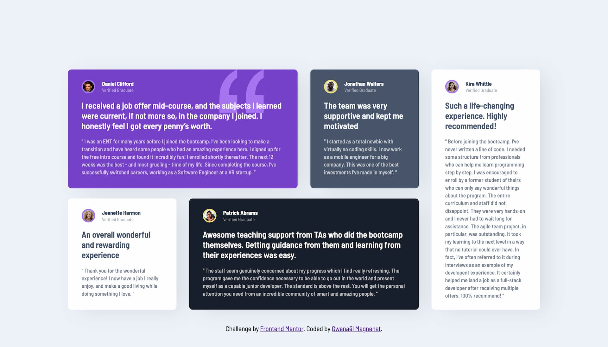

# Frontend Mentor - Testimonials grid section solution

This is a solution to the [Testimonials grid section challenge on Frontend Mentor](https://www.frontendmentor.io/challenges/testimonials-grid-section-Nnw6J7Un7). Frontend Mentor challenges help you improve your coding skills by building realistic projects.

## Table of contents

- [Overview](#overview)
  - [The challenge](#the-challenge)
  - [Screenshot](#screenshot)
  - [Links](#links)
- [My process](#my-process)
  - [Built with](#built-with)
  - [What I learned](#what-i-learned)
  - [Continued development](#continued-development)
- [Author](#author)

## Overview

### The challenge

Users should be able to:

- View the optimal layout for the site depending on their device's screen size

### Screenshot



### Links

- Solution URL: [Add solution URL here](https://your-solution-url.com)
- Live Site URL: [Add live site URL here](https://your-live-site-url.com)

## My process

- inspect the design
- prepare the project folder with the appropriate tools for my workflow
- implement the mobile version
- plan the grid layout switch for desktop
- implement the grid
- fix issues

I added the option to control the profile image ring by sending different attribute from html.

### Built with

- Semantic HTML5 markup
- CSS custom properties
- Flexbox
- CSS Grid
- Mobile-first workflow

### What I learned

**(1)**. Sometimes when coding a desgin we can find inconsistent values between similar elements. This may be something not intended by the designer. The best is to double check with the designer to make sure this is not intended before doing to many tricks to handle these design situations. By converting a design to screens we can always improve the intention started by the designer.
Copying static designs to the pixel does not make a lot of sense.

"As developers we should be extracting the systems and the intent ouf of the design" (@AlexKMarshall)

**(2)**
I wrote a scss mixin to handle the card text color based on the background color lightness. Under a certain value, the text color will dark. Above, the text color will be light.

```scss
@mixin color-scheme($bg, $text) {
  @if lightness($bg) < 50 {
    color: $clr-white;
    background-color: $bg;
  } @else {
    color: $text;
    background-color: $bg;
  }
}
```

---

### Continued development

Improve the card style to make the styling more flexible. Add other custom data atrributes comming from the HTML maybe to control how the card look.

## Author

- Website - [Gwenaël Magnenat](https://gmagnenat.com)
- Frontend Mentor - [@gmagnenat](https://www.frontendmentor.io/profile/gmagnenat)
- LinkedIn - [@gmagnenat](https://www.linkedin.com/in/gmagnenat)
